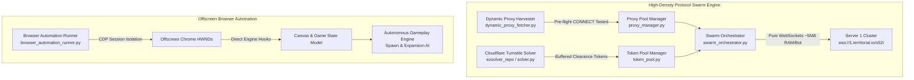

# TerriX: Advanced Territorial.io Reverse Engineering & Swarm Automation Framework

A high-performance research suite, protocol-level swarm engine, autonomous gameplay controller, and disassembly framework for [Territorial.io](https://territorial.io).

---

## Technical Architecture Overview



### Core Capabilities
1. **High-Density Protocol Swarm Engine**: Pure asynchronous WebSocket engine executing complete binary bitstreams with $< 5\text{ MB}$ RAM overhead per bot (100+ bots run concurrently under $500\text{ MB}$ total RAM).
2. **Zero-Signup Dynamic Proxy Aggregator**: Automatically harvests, validates, and rotates thousands of live HTTP and SOCKS5 proxies using concurrent pre-flight CONNECT handshakes against `territorial.io:443`.
3. **Turnstile Token Pool & Buffer Manager**: Offscreen solver engine powered by `nodriver` pre-caching Cloudflare Turnstile tokens (valid for 5 minutes) to eliminate in-match solve latency.
4. **Autonomous Gameplay Engine**: Reverse-engineered game state model executing mathematical spawn optimization and compound interest opening land rushes.
5. **Multi-Instance Lobby Convergence**: Barrier synchronization coordinator locking entire teams and bot swarms into the exact same countdown cycle and lobby roster.

---

## Directory Layout

```text
g:/TerriX/
├── proxy.txt                       # Active verified HTTP / SOCKS5 proxy pool
├── game.js                         # Beautified client engine (39,594 lines, 1,267 functions)
├── game.min.js                     # Upstream production client script
├── index.html                      # Local development runner
├── styles.css                      # Extracted UI stylesheet
├── ezsolver_repo/                  # Local Cloudflare Turnstile solver
│   ├── solver.py                   # Real Chrome Turnstile solver via nodriver
│   ├── service.py                  # Standalone solver HTTP microservice (port 8191)
│   └── README.md                   # Solver documentation
├── data/                           # Extracted tables, rankings, and names
│   ├── names.txt                   # Swarm nickname generator list
│   ├── clans.txt                   # Clan leaderboards and score records
│   └── string_table.json           # Decoded localization dictionary (Array S)
└── scripts/                        # Core automation and network modules
    ├── dynamic_proxy_fetcher.py    # Zero-signup proxy harvester & pre-flight health tester
    ├── proxy_manager.py            # Proxy pool loader, rotator, and dynamic fallback
    ├── token_pool.py               # Pre-cached Turnstile token buffer manager
    ├── swarm_orchestrator.py       # High-density protocol-level swarm engine (20–100+ bots)
    ├── direct_websocket_engine.py  # Binary bitstream serializer & frame definitions
    ├── browser_automation_runner.py# Multi-instance Chrome CDP automation & gameplay AI
    ├── account_creator.py          # Automated account registration pipeline
    └── download_all.py             # Asset and client scraper
```

---

## Quick Start & Usage Guides

### 1. High-Density Swarm Orchestrator (Protocol WebSockets)

Run 20 to 100+ bots directly at the protocol level without launching heavy browser windows:

```powershell
# Launch 20 swarm bots in Team mode on map Europe:
python scripts/swarm_orchestrator.py --count 20 --mode team --map Europe --tag "[SWARM]"

# Force a fresh dynamic proxy harvest on startup:
python scripts/swarm_orchestrator.py --count 20 --dynamic --mode team --map Europe --tag "[SWARM]"

# FFA / Battle Royale Mode:
python scripts/swarm_orchestrator.py --count 50 --mode ffa --map World --tag "[HORDE]"
```

#### CLI Options:
| Flag | Type | Default | Description |
| :--- | :--- | :--- | :--- |
| `--count` | `int` | `20` | Target number of concurrent swarm bots (e.g. `20` to `100+`). |
| `--mode` | `str` | `team` | Game mode: `team`, `ffa`, `br`, `1v1`, `zombies`. |
| `--map` | `str` | `Europe` | Target map: `Europe`, `World`, `Caucasia`, `Asia`, `Island`. |
| `--tag` | `str` | `[SWARM]` | Clan tag prefix prepended to bot usernames. |
| `--proxies` | `str` | `proxy.txt` | Path to proxy file. |
| `--dynamic` | `flag` | `False` | Forces dynamic proxy harvesting on launch. |

---

### 2. Zero-Signup Dynamic Proxy Harvester

To refresh or validate proxies independently without manual copy-pasting:

```powershell
# Harvest and pre-flight validate 30 active SOCKS5/HTTP tunnels:
python scripts/dynamic_proxy_fetcher.py 30

# Inspect and reload proxy pool via ProxyManager CLI:
python scripts/proxy_manager.py --fetch 50
```

- **Supported Feeds**: GeoNode API, ProxyScrape v2, Monosans GitHub Live, TheSpeedX Live.
- **Pre-flight Filter**: Concurrent async `CONNECT territorial.io:443` and SOCKS5 handshake testing with $< 2.5\text{s}$ timeout across 80 parallel workers.

---

### 3. Turnstile Token Pool & Solver Service

To pre-warm and inspect Cloudflare Turnstile clearance tokens:

```powershell
# Run standalone Turnstile solve test:
python ezsolver_repo/solver.py 0x4AAAAAAEI8HZoG8nJMzxt1 https://territorial.io/

# Inspect token buffer status:
python scripts/token_pool.py
```

- **Profile Storage**: Kept strictly in `G:\TerriX\.chrome_sessions` to protect Drive C: disk space.
- **Stealth Architecture**: Offscreen window placement (`--window-position=-2500,-2500`) with authentic OS HWND handle to bypass Cloudflare headless heuristics.

---

### 4. Offscreen Browser Automation Runner

To run visual or CDP-driven gameplay automation across multiple accounts:

```powershell
# Run 2 coordinated browser instances in Team mode:
python scripts/browser_automation_runner.py --count 2 --mode team --duration 60 --headless

# Run single visible browser instance for gameplay observation:
python scripts/browser_automation_runner.py --account-index 0 --mode team --map Europe
```

---

## Binary Network Protocol Reference

Multiplayer communication operates over binary WebSockets (`wss://1.territorial.io/s52/`).

### Bitstream Framing

All packets are framed with a **1-bit flag** (`0`) followed by a **6-bit Opcode**:

```text
[ 1 Bit: Flag 0 ][ 6 Bits: Opcode ][ Payload Bits... ]
```

| Opcode | Engine ID | Direction | Bit Length | Description |
| :---: | :---: | :---: | :---: | :--- |
| **13** | `aV9` | Client $\rightarrow$ Server | 178 bits | **Handshake & Version Declaration**: Enforces 14-bit Build Number (currently `1759`), domain flag, and 15-char device token. |
| **9** | `aVQ` | Server $\rightarrow$ Client | 197 bits | **Cryptographic Pre-image Challenge**: Emits `seedA` (30b), `seedB` (30b), and `targetHash` (30b). |
| **30** | `aW0` | Client $\rightarrow$ Server | 70 bits | **Pre-image Solution**: Submits the brute-forced preimage solution from `compute_mixed_hash`. |
| **1** | `aHd` | Client $\rightarrow$ Server | Dynamic | **Player Identity & Color**: Encodes UTF-16 username, time seed, and 18-bit RGB color. |
| **6** | `b1.ef.f0` | Client $\rightarrow$ Server | Dynamic | **Turnstile Clearance Token**: 16-bit length prefix + 7-bit ASCII characters of `cf-turnstile-response`. |
| **2** | `aG7` | Client $\rightarrow$ Server | 12 bits | **Lobby Navigation & Ready**: Mode select (Action 2), Ready toggle (Action 4: `aTJ(1)`). |
| **4** | `aUb` | Client $\leftrightarrow$ Server | 11 bits | **Lobby Heartbeat**: Mode confirmation and keepalive tick. |
| **17** | `aVx` | Client $\rightarrow$ Server | 127 bits | **Account Credentials**: 5-char name + 15-char password in 64-char engine alphabet. |
| **21** | `aSC` | Client $\rightarrow$ Server | Dynamic | **In-Game Action / Attack**: Slider percentage, target player ID, and attack vector. |

---

## Error Codes & Troubleshooting

| Code | Message / Symptom | Root Cause | Solution |
| :---: | :--- | :--- | :--- |
| **`4211`** | `🚀 New Game Update` | **Build Number / Handshake Mismatch**: Handshake buffer was formatted with wrong bit-width or outdated build number. | Handshake is strictly 178 bits with 14-bit Build Number `1759`. Fully resolved in [`swarm_orchestrator.py`](file:///g:/TerriX/scripts/swarm_orchestrator.py#L64-L85). |
| **`4591`** | `🤖 Bot Detection: The algo thinks you are a bot` | **Turnstile Token Missing or IP Divergence**: Opcode 6 was missing or the token was minted on an IP different from the WebSocket egress IP. | Synchronize EzSolver proxy assignment or utilize direct token binding. |
| **`245`** | `turnstile error 245` | **Prototype Trap Pollution**: Defining `trap("turnstile", ...)` on `Object.prototype` aborted Cloudflare's loader. | Hook `trap("eU", "bX", ...)` instead of `window.turnstile`. |
| **`246`** | `turnstile error 246` | **Concurrent Widget Collision**: Entering Multiplayer triggered `bX.turnstile.et()` while an initial page solve was still in progress. | Await `window.__terrix_turnstile_success` before clicking Multiplayer. |
| **`500`** | `Failed to connect to browser` in EzSolver | **Chrome User Data Directory Lock**: Multiple processes attempted to access the same profile folder simultaneously. | Profile directories are uniquely isolated per worker in `G:\TerriX\.chrome_sessions`. |

---

## Autonomous Gameplay Engine Architecture

### Step 1: Strategic Spawn Optimizer (`TerriXSpawnOptimizer`)
- **Sampling Scheme**: Coarse-to-fine candidate grid sampling ($24\text{px}$ coarse $\rightarrow$ $4\text{px}$ fine local refinement).
- **Multi-Factor Fitness Function**:
  $$S(x, y) = w_L \cdot S_{land} - w_E \cdot P_{enemy} + w_C \cdot S_{corner} + w_T \cdot S_{team} - w_S \cdot P_{swarm}$$
  - $S_{land}$: Concentric ring density at $r \in \{25, 50, 85, 130, 180\}\text{px}$ weighted by $1/\sqrt{r}$.
  - $P_{enemy}$: Hard lethal exclusion within $80\text{px}$ of hostiles; parabolic clearance penalty up to $180\text{px}$.
  - $S_{corner}$: Border and coastline defense bonus for back-to-ocean safety.
  - $S_{team} / P_{swarm}$: Team clustering and swarm anti-cannibalization spacing ($110\text{px} \dots 260\text{px}$).
- **Direct Dispatch**: Invokes `bB.hr.hs(best_fD)` directly in memory, transmitting binary network frame `b1.pm.pn(fD)` with zero pointer lag.

### Step 2: Opening Land Rush & Compound Interest Compounding
- **Troop Deployment Ratio**: Dynamic slider scaling (20% to 25% attack volume per burst).
- **Compound Interest Preservation**: Holds attacks if army balance $< 180$ troops to maximize exponential compound growth.
- **Rhythmic Expansion Bursts**: Timed expansion waves every $1.6\text{s}$ aligned with engine interest cycles.
- **Frontier Exhaustion Transition**: Continuously monitors neutral border adjacency via `bv.hx(myId)`. Automatically transitions to `MID_GAME_CONSOLIDATION` once contiguous neutral land is depleted, banking troops for mid-game combat.

---

## Local Development Server

Run the fully extracted local game client:

```powershell
python -m http.server 8080
```

Open `http://localhost:8080/index.html` in any browser.
- **Singleplayer / Custom Scenario**: 100% functional offline with all maps.
- **Multiplayer**: Configured to connect to production clusters or local WebSocket test servers.
